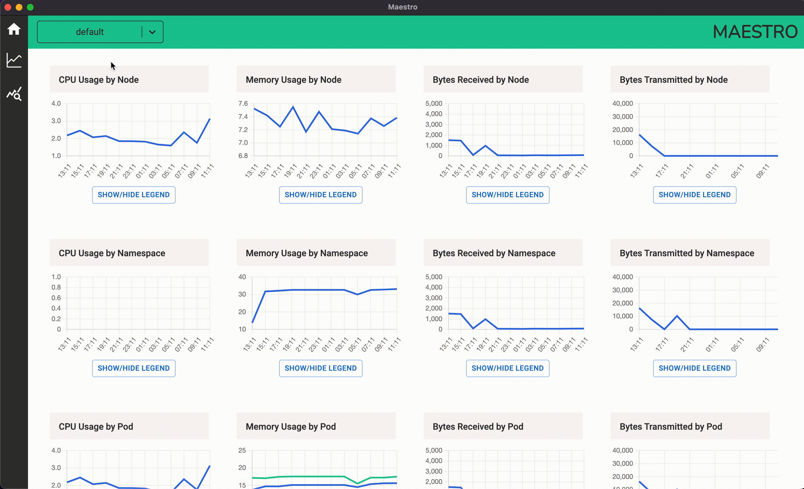

# MAESTRO

A Kubernetes monitoring tool built on electron.

## Summary

Maestro is an open-source monitoring tool for keeping track of the health of your Kubernetes cluster. Maestro is lightweight and allows users to view key metrics at a glance. This tool leverages the K8s API to obtain important cluster data, and promQL queries to scrape key metrics and display them in a digestible format.

## Features

1. At a glance overview of nodes, pods, services, and deployments visualized as cubes. Hover over any cube to see which node, pod, deployment, or servie you are looking at.


2. Log GUI to quickly view alerts and events in an easy to read format, with the ability to sort by severity.


3. Graphs displaying key metrics such at CPU usage, memory usage, and network I/O. Multi-colored line graphs map to corresponding properties in the legend, where you can remove properties tht you wwant to get a more narrowly focused graph.



## Getting Started

### 1. Prerequisites
Users must have Prometheus installed on their Kubernetes cluster.

### 2. Clone this repo using the following command

```
https://github.com/oslabs-beta/maestro.git
```

### 3. Make sure your cluster is ported forward to port 9090 using the following command

```
kubectl port-forward -n default svc/prometheus-kube-prometheus-prometheus 9090 
```

### 4. In the Maestro directory in your terminal, run the following commands

```
npm install
npm run webpack-start
npm run start
```

### 5. Enjoy your Maestro experience!

## Built With

- [Electron](https://www.electronjs.org/)
- [React](https://reactjs.org/)
- [React Router](https://reactrouter.com/)
- [Redux](https://redux.js.org/)
- [Node](https://nodejs.org/)
- [Kubernetes-client](https://github.com/kubernetes-client/)
- [Prometheus](https://prometheus.io/)
- [Material UI](https://mui.com/)
- [Chart.js](https://www.chartjs.org/)

## The Team

- Peter Kennedy [Github](https://github.com/peterkennedy97) [LinkedIn](https://www.linkedin.com/in/peter-kennedy/)
- Aliya Yano [Github](https://github.com/ajyano22) [LinkedIn](https://www.linkedin.com/in/aliya-yano-8a2548126/)
- Jakob Schillinger [Github](https://github.com/gandalf77)
- Alex Ryu [Github](https://github.com/RyuBoyCoding) [LinkedIn](www.linkedin.com/in/ryu-alex)
